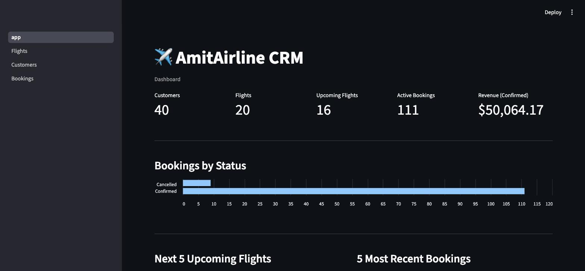

# AmitAirline CRM

A simple internal CRM for a fictional airline, built with Streamlit and
SQLite. Lets a travel agent browse flights, browse customers, and manage
bookings (create / cancel) — all backed by hand-rolled synthetic data.

No authentication — single-user, local tool.

**Status**: complete — built in 4 phases, see
[`docs/02 - Dev Log.md`](docs/02%20-%20Dev%20Log.md) for the full history.



## Setup

```bash
pip install -r requirements.txt
```

## Generate synthetic data

```bash
python3 generate_data.py
```

Safe to re-run any time — it drops and recreates the database with a fresh
seeded dataset (~40 customers, ~20 flights, ~120 bookings).

## Run the app

```bash
streamlit run app.py
```

## Project layout

See [`docs/01 - Architecture.md`](docs/01%20-%20Architecture.md) for the
schema and file layout, and [`docs/00 - Project Hub.md`](docs/00%20-%20Project%20Hub.md)
for project goals and status.
